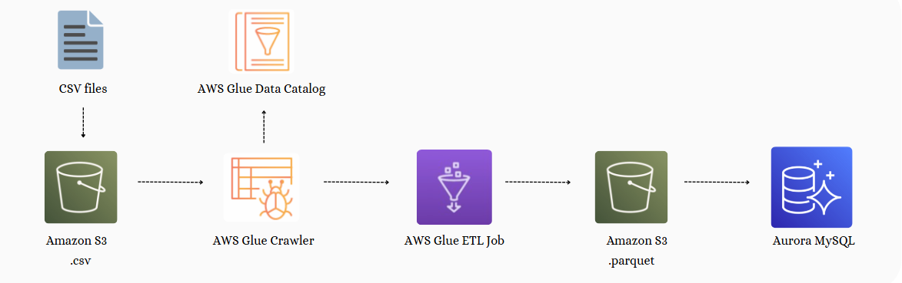
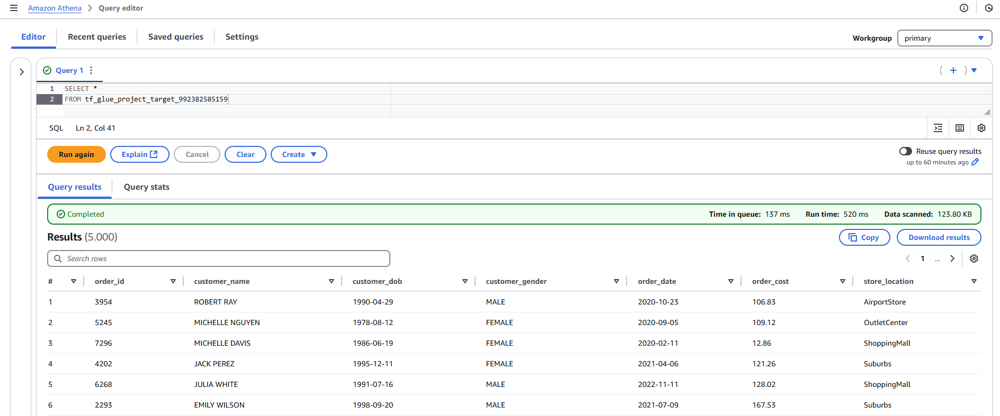

# ETL with AWS Glue, S3, Athena and Terraform

This project applies IaC with Terraform to manage the infrastructure for an ETL pipeline, processing CSV data using AWS Glue and enabling data consumption directly from S3 using Amazon Athena.

---

## Architecture


<details>
  <summary> <b>Project Implementation Details</b> </summary>

- **Configuring S3 Backend and DynamoDB for Locks:** Set up an S3 bucket to store Terraform state files and a DynamoDB table to manage state locking.

- **Creating S3 Buckets:** Three buckets are provisioned to handle source data, transformed data, and Glue scripts.

- **Uploading Files:** CSV files from the `mock_data/` directory are uploaded to the source bucket.

- **Configuring IAM Roles:** Permissions are set up to allow Glue to interact with S3.

- **Setting Up AWS Glue:** 
  - A database catalogs the data schema.
  - A crawler detects and updates the schema.
  - A job converts CSV files into Parquet format while making the necessary adjustments to the data structure.

- **Configuring Triggers:** Automates workflows to run on file uploads to the source bucket.

- **Setting Up Athena:** A query is created in Amazon Athena to directly consume and analyze Parquet data stored in S3.

- **Implementing GitHub Actions:** CI/CD pipelines automate Terraform deployments for efficient infrastructure management.

</details>

---

## How to run the project

### Local Setup
1. Clone the Repository
   
   ```bash
   git clone https://github.com/marianamannes/terraform-aws-glue
   cd terraform-aws-glue
   ```
2. Install Prerequisites 
   - [Terraform](https://developer.hashicorp.com/terraform/downloads) (version >= 1.10.0)
   - [AWS CLI](https://aws.amazon.com/cli/) (version >= 2.15.23)
3. Configure AWS CLI
   ```bash
    aws configure
   ```
4. Initialize Terraform Backend
   ```bash
    cd terraform/modules/remote-state
    terraform init
    terraform apply
   ```
5. Apply changes
   ```bash
    cd ../../
    terraform init
    terraform apply
   ```
5. Query transformed data with Athena

   

---

## References
- [Authenticating using IAM user credentials for the AWS CLI](https://docs.aws.amazon.com/cli/v1/userguide/cli-authentication-user.html)
- [AWS Provider](https://registry.terraform.io/providers/hashicorp/aws/latest/docs)
- [Terraform Best Practices](https://www.terraform-best-practices.com/)
- [S3 Terraform Backend](https://developer.hashicorp.com/terraform/language/backend/s3)
- [Configure IAM for Glue](https://docs.aws.amazon.com/glue/latest/dg/configure-iam-for-glue.html)